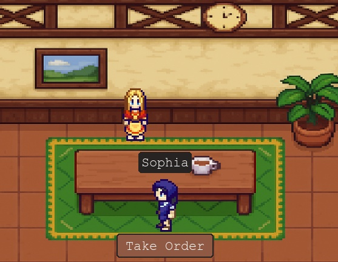
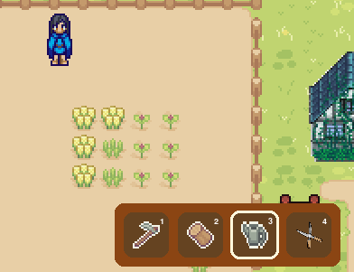
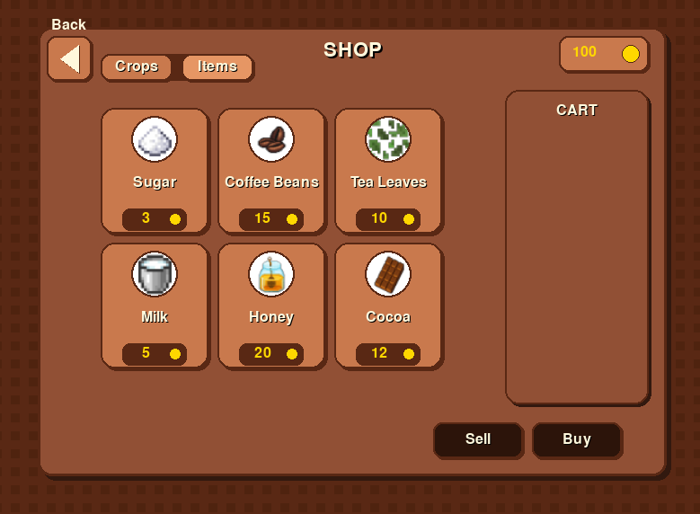
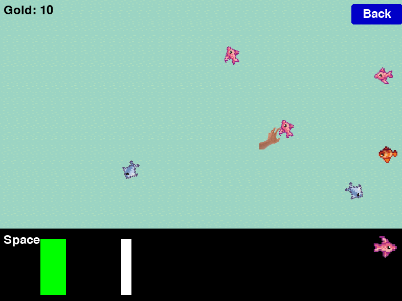

# 8BitBarista
**A Retro Coffee Shop/Farming Simulator & Minigame Engine** *Built with Python, Pygame, and SQLite*


## 🚀 Overview
8BitBarista is a high-fidelity retro simulation featuring complex state management, a dynamic SQLite-backed save system, and interactive minigames. This repository represents the **Refactored Edition**, focusing on modularity, database integrity, and a professionalized asset pipeline.

## 🛠️ Tech Stack
* **Language:** Python 3.x
* **Graphics:** Pygame
* **Database:** SQLite (Relational data for user states, login credentials, and inventory)
* **Design:** Figma (UI/UX Prototyping)
* **Map Editor:** Tiled (used to design and build the world map)

---

## 📅 Development Roadmap (Sprints)

### **Phase 1: Foundation & Mechanics**
* **Sprint 1: UI/UX Prototyping** – Created high-fidelity Figma prototypes for all user stories and core task flows.
* **Sprint 2: Core Infrastructure** – Implemented base features: User authentication (Login/Registration), world map, character sprites, grid-based movement, and farming mechanics.
* **Sprint 3: Systems Expansion** – Developed environmental and gameplay systems: Dynamic weather, in-game time cycles, inventory management, shop interfaces, and the fishing minigame.

### **Phase 2: Polishing & Finalization**
* **Sprint 4: Feature Completion** – Finalized semester goals:
    * UI Overhaul: Re-designed interfaces for the Shop, Fishing, and Store for better user feedback.
    * Customization: Added pet systems, house upgrades, and dynamic background music.
    * Persistence: Implemented the initial Save/Load game feature.
* **Sprint 5: Future Plans** – Improve the Save system architecture and finalize the Settings menu (Volume, Game Speed, etc.).

### **Phase 3: Independent Refactor (Personal Sprint)**
As the project transitioned from a group prototype to a portfolio-ready product, I performed a specialized **Cleanup & Quality Assurance Sprint**:
* **Repository Migration:** Deployed code to a clean repository to manage technical debt.
* **Asset Pipeline:** Organized fragmented files into a standardized directory hierarchy to fix relative pathing issues.
* **Documentation:** Authored a comprehensive README and installation guide to ensure 100% reproducibility for external developers.

## 👤 My Specific Contributions (Emrana Begum / notEmmi)

These are the concrete systems and features I implemented or significantly improved:

* **World & Map Systems**
   * Built and refined the playable map layout using Tiled, including interactive world navigation and environment polish.
   * Implemented clickable building interactions and building-related world flow.

* **Shop & Economy UX**
   * Redesigned and improved the Shop/Store UI for clearer purchasing flow and player feedback.
   * Contributed to economy loops connecting fish/crop actions to gold progression.

* **Customer Interaction Systems**
   * Implemented customer-facing interaction flows, including order-related gameplay logic.
   * Improved player-to-customer feedback loops to make cafe interactions more readable.

* **Character & Visual Asset Work**
   * Built the character selection experience and integrated selection flow into game startup.
   * Created and integrated sprite assets used across player, environment, and interaction contexts.

* **Farming Mechanics (Core Gameplay)**
   * Implemented planting and harvesting flows.
   * Built tool-based interactions such as hoe and watering-can usage.
   * Connected farming actions to inventory/progression behavior.

* **Related Feature Workstreams / Branches (Original Upstream Repository)**
   * Note: These branch names are from the original repository I forked from and represent my contribution history there; they may not appear in the current repository branch list.
   * `solve-dev-main-conflict`
   * `#76-connect-recipe-to-game`
   * `#63-customer-orders`
   * `#85-catch_fish_funct`
   * `65-toolbox-system`
   * `106-music-options`
   * `#75-Shop`
   * `#87-fish_into_gold`
   * `#86-variety_of_fish`
   * `95-clickable-buildings`
   * `84-planting-harvesting`
   * `79-watering-can-interaction`
   * `feature/#83-Buildings`
   * `66-hoe-tool-interaction`
   * `62-improve-first-game-page`
   * `51-character-selection-page`

---

## 🖼️ Game Gallery
| ☕ Inside the Cafe | 🌾 Farming Mechanics |
| :---: | :---: |
|  |  |
| *Managing NPC interactions and barista order-taking* | *Grid-based crop cultivation and tool selection system* |

| 🛒 The Shop | 🎣 Fishing Minigame |
| :---: | :---: |
|  |  |
| *SQLite-driven inventory shop for items and crops* | *Timing-based reaction minigame with dynamic gold rewards* |

## 📂 Project Layout
- `Game.py` – Login launcher and main application entry point.
- `first_page.py` – Primary in-game state controller and logic flow.
- `screens/` – Modular UI components (Login, Menus, Selection, Options).
- `assets/` – Centralized images, map data, sounds, and sprites.
- `data/sql/` – SQL schema and seed files for the SQLite backend.

## ⚙️ Installation & Execution
1. **Clone & Navigate:**
   ```bash
   git clone https://github.com/notEmmi/8-bit-barista-refactor
   cd 8-bit-barista-refactor

2. **Install & Run:**
   ```bash
   pip install -r requirements.txt
   python Game.py
   ---
